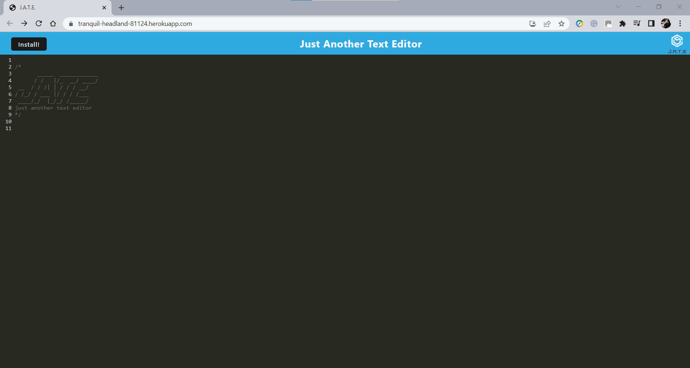
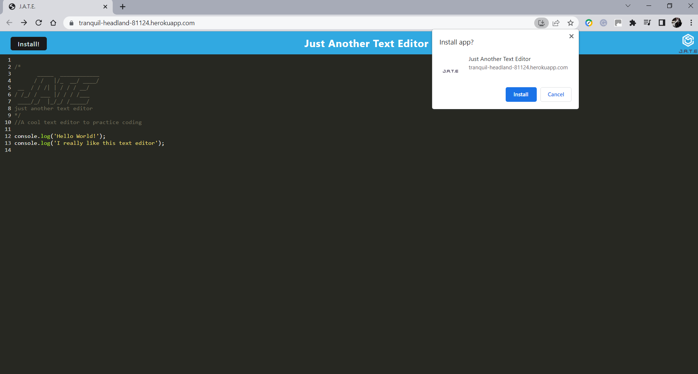
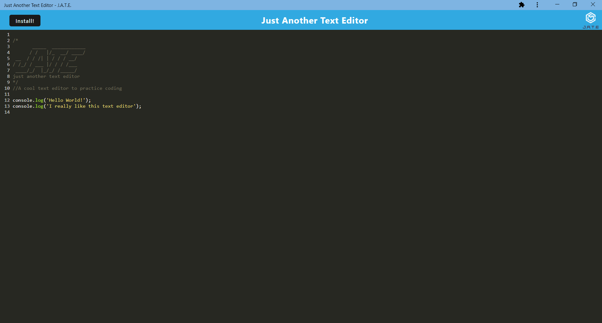

# Text Editor

## Table of Contents

- [Project Description](#Project-Description)
- [User Story](#User-Story)
- [Usage](#Usage)
- [Screen Captures](#Screen-Captures)
- [Technologies](#Technologies)
- [Links](#Links)


## Project Description

This project is a single-page Text Editor application that runs in the browser and meets the PWA criteria. It features several data persistence techniques that serve as redundancies in case one of the options is not supported by the browser. The application implements IndexedDB to create and manage the database for the app. It also implements a service worker using Workbox to provide offline access to the app. In addition, cache strategies are in place to give users a great user experience while using Text Editor.
###### [Back to Index](#Table-of-Contents)


## User Story

```
AS A developer
I WANT to create notes or code snippets with or without an internet connection
SO THAT I can reliably retrieve them for later use.
```
###### [Back to Index](#Table-of-Contents)


## Usage

To start using the Text Editor first clone this repo. Then, in the command line from the root directory of the project run the following commands:

```
$ npm install
$ npm start
```

It is then possible to run the app locally.

###### [Back to Index](#Table-of-Contents)


## Screen Captures







###### [Back to Index](#Table-of-Contents)


## Technologies


###### [Back to Index](#Table-of-Contents)


## Links

- [Deployed Application](https://tranquil-headland-81124.herokuapp.com/)
- [GitHub Repository](https://github.com/AlexJCturbo/text_editor)

###### [Back to Index](#Table-of-Contents)